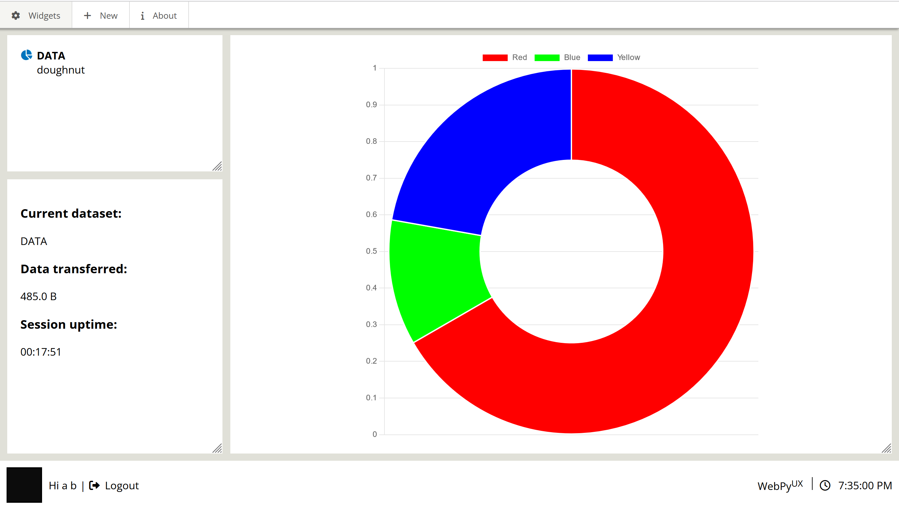

# Webpyux Closed Beta Test

## how to run:
- on Linux
```bash
git clone --recurse-submodules https://github.com/AlyShmahell/webpyux-cbt
cd webpyux-cbt
python -m venv .env
source .env/bin/activate
pip install -r requirements.txt
python server.py
```
- on Windows PowerShell
```bash
git clone --recurse-submodules https://github.com/AlyShmahell/webpyux-cbt
cd webpyux-cbt
python -m venv .env
.env/Scripts/Activate.ps1
pip install -r requirements.txt
python server.py
```
## Webpyux Update (Optional)
```bash
git clone --recurse-submodules https://github.com/AlyShmahell/webpyux-cbt
cd webpyux-cbt
git submodule update --remote
```
## Results
- startup process

- spinner

- chart

- chart
